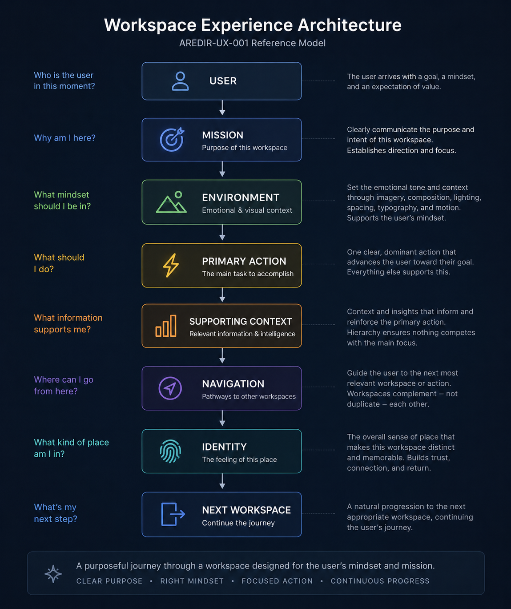

# Workspace Experience Architecture

| Field | Value |
|-------|-------|
| **Name** | Workspace Experience Architecture |
| **ID** | AREDIR-UX-001 |
| **Status** | Promoted Standard |
| **Category** | Architecture Pattern |
| **Version** | 1.1 |
| **Owner** | Aredir Labs |
| **Origin Projects** | AlignFit |
| **Origin Artifacts** | COACH-UX-001, COACH_EXPERIENCE_ARCHITECTURE, AlignFit workspace evolution |
| **Linked Projects** | AlignFit, ClassForge, LeagueOS, Aredir Labs |
| **Reusability** | High |
| **Last Reviewed** | 2026-06-25 |
| **Next Review Due** | 2026-09-12 |

## Executive Summary

Aredir Labs established engineering architecture standards that govern ownership, persistence, routing, workflows, AI reasoning, and data contracts. Those standards organize **software** — how systems are built, bounded, and maintained.

User Experience Architecture organizes **human attention** — how people understand where they are, what matters, and what to do next.

Engineering architecture and experience architecture are complementary. Neither replaces the other. Exceptional products require both: systems that are well-engineered and experiences that feel purposeful.

This document is the first promoted **User Experience Architecture** standard for Aredir Labs. It defines how products should be experienced — not merely how they should be engineered. AlignFit served as the motivating implementation example; the philosophy applies to all future Aredir Labs products.

---

## Philosophy

> Software should not feel like a collection of pages.

Instead:

> Software should feel like entering purpose-built workspaces.

A workspace is not a screen, route, or layout template. It is a place where a user enters with a clear purpose, orients emotionally, performs a primary action, and moves naturally toward the next meaningful place.

Products that feel like page collections scatter attention. Products that feel like workspaces concentrate it. Users should sense intent before they interact.

---

## Experience Before Interface

Interfaces are assembled from components. Experiences are composed around human intent.

| Layer | Organizes |
|-------|-----------|
| **Engineering** | Software — ownership, contracts, persistence, routing |
| **Experience** | Attention — mission, focus, hierarchy, emotion, identity |

Interface implementation should emerge from the intended experience. Component structure should not dictate presentation. When implementation drives layout, users inherit the structure of the codebase rather than the structure of their goals.

**Foundational principle:** Design the experience first. Compose interfaces to support it.

---

## Workspace Experience Model

Every meaningful product surface in an Aredir Labs product should be understood as a **workspace** with six elements. Together they create orientation — the feeling of entering a place designed for a purpose.

**Figure 1 — Workspace Experience Architecture**

> The canonical Workspace Experience model illustrating how Aredir Labs products guide users from purpose through action toward the next logical workspace.

| Element | Question it answers |
|---------|---------------------|
| Mission | Why am I here? |
| Environment | What mindset should I bring? |
| Primary Action | What should I do? |
| Supporting Context | What information reinforces that action? |
| Navigation | Where should I go next? |
| Identity | What kind of place is this? |

---

## Mission

Every workspace exists to accomplish a **single purpose**.

Mission answers: **Why am I here?**

Mission is not merely a heading or page title. Mission establishes intent. It tells the user what this place is for before they scan content or interact with controls.

| Weak mission | Strong mission |
|--------------|----------------|
| "Dashboard" | "Review today's training priorities" |
| "Settings" | "Configure how your coach communicates with you" |
| "Reports" | "Understand what changed this week" |

When mission is unclear, users treat the workspace as a container and search for meaning inside it. When mission is clear, users enter already oriented.

---

## Environment

**Environmental Identity** creates emotional context — not visual decoration.

Environment is expressed through:

- imagery
- composition
- spacing
- lighting
- typography
- motion
- hierarchy

Every Aredir Labs product should establish its own environmental language. Environmental identity reinforces the user's mindset for the work at hand.

A training review workspace should feel different from a match-day briefing workspace — not because they use different components, but because they evoke different emotional orientation.

Environment supports mission. It does not compete with it.

---

## Primary Action

Every workspace should clearly communicate the user's **primary task**.

Secondary information should support — not compete with — that action.

| Principle | Application |
|-----------|-------------|
| **One dominant action** | The user should know what to do without reading everything |
| **Supporting hierarchy** | Secondary actions are visible but subordinate |
| **Action proximity** | Primary actions sit near the information they affect |
| **Reduced competition** | Equal visual weight across unrelated actions creates paralysis |

When everything looks equally important, nothing feels important. Primary action establishes the workspace's operational center.

---

## Supporting Context

Supporting information exists to reinforce the primary mission — not to fill available space.

| Principle | Application |
|-----------|-------------|
| **Hierarchy** | Supporting context is visually and structurally subordinate to mission and primary action |
| **Relevance** | Context shown should directly support the current purpose |
| **Progressive disclosure** | Summary first; detail on demand |
| **No equal-weight clutter** | Avoid presenting unrelated information with equal visual importance |

Supporting context is not optional decoration. It is curated reinforcement. Every element should earn its presence by helping the user accomplish the mission.

---

## Navigation

Navigation should naturally guide users toward the **next logical workspace**.

| Principle | Application |
|-----------|-------------|
| **Workspace complement** | Each workspace has a distinct responsibility; avoid duplication |
| **Logical progression** | Navigation reflects how users actually move through their work |
| **Intent-based paths** | Users navigate by purpose, not by structural taxonomy |
| **Return orientation** | Users can return to prior workspaces without losing context |

Workspaces should complement one another rather than duplicate responsibilities. Navigation is not a map of the application structure — it is a map of the user's journey.

The [Workspace-First AI Experience Pattern](./WORKSPACE_FIRST_AI_EXPERIENCE_PATTERN.md) defines durable intelligence surfaces for AI products. This document defines the experiential principles those surfaces should embody.

---

## Identity

Every workspace should feel like **entering a place**.

Identity is achieved through emotional orientation rather than decorative branding.

| Identity through | Not through |
|------------------|-------------|
| Environmental language | Logo repetition |
| Compositional rhythm | Generic layout templates |
| Purposeful atmosphere | Decorative chrome |
| Consistent place-making | Visual sameness across unrelated tasks |

Users should sense what kind of place they have entered before they read a word. Identity makes workspaces memorable and navigable by feeling, not only by labels.

---

## Product Environmental Identity

Aredir Labs products should not share imagery. They should share **philosophy**.

Each product establishes its own environmental language while adhering to the workspace experience model. The following are **examples of environmental identity** — illustrative mindsets, not implementation requirements:

| Product | Environmental identity (examples) |
|---------|-------------------------------------|
| **AlignFit** | Purpose. Growth. Discipline. Natural horizons. |
| **LeagueOS** | Competition. Strategy. Game-day atmosphere. |
| **ClassForge** | Learning. Organization. Curiosity. |
| **Aredir Labs** | Precision. Engineering. Craftsmanship. |

Products may express these qualities through different imagery, composition, and atmosphere. What they share is intentional place-making: every workspace feels designed for a mindset, not assembled from defaults.

---

## Composition Philosophy

Workspaces should be designed as **complete compositions**.

| Composition establishes | Components should |
|---------------------------|-------------------|
| Hierarchy | Support composition |
| Attention | Not define it |
| Information flow | Adapt to experiential intent |
| Emotional context | Serve the workspace mission |

Avoid allowing implementation components to dictate layout. A card grid, sidebar, or tab strip is an implementation choice. Composition is an experiential choice.

When composition leads, users experience intentional design. When components lead, users experience structural accident.

---

## Relationship to Engineering Architecture

User Experience Architecture complements existing Aredir Labs engineering standards. Neither replaces the other.

| Engineering architecture defines | Experience architecture defines |
|-----------------------------------|--------------------------------|
| Ownership | Mission |
| Contracts | Focus |
| Persistence | Hierarchy |
| Routing | Emotion |
| Workflows | Identity |

### Related engineering and architecture standards

| Standard | Relationship |
|----------|--------------|
| [AI Intelligence Architecture Pattern](./AI_INTELLIGENCE_ARCHITECTURE_PATTERN.md) | Defines how intelligence is computed; experience architecture defines how users encounter it |
| [Workspace-First AI Experience Pattern](./WORKSPACE_FIRST_AI_EXPERIENCE_PATTERN.md) | Defines workspace surface topology for AI products; this document defines experiential principles for any workspace |
| [Human + AI Advisor Workspace Pattern](../ai-patterns/HUMAN_AI_ADVISOR_WORKSPACE_PATTERN.md) | Defines multi-advisor collaboration surfaces; experience architecture governs how those surfaces feel |
| [Reference Repository Specification](../REFERENCE_REPOSITORY_SPECIFICATION.md) | Engineering platform inheritance; experience standards apply when products implement surfaces |
| [Design Governance](../governance/DESIGN_GOVERNANCE.md) | Operational design principles; this document is the canonical experience architecture standard |
| [Engineering Operating System](../ENGINEERING_OPERATING_SYSTEM.md) | Company methodology; experience architecture is a layer within the EOS |

AlignFit's engineering evolution demonstrated that robust architecture alone does not answer how a product should feel. COACH-UX-001 and COACH_EXPERIENCE_ARCHITECTURE surfaced the gap between engineered surfaces and experienced places. This standard closes that gap at the company level.

---

## Success Criteria

Experience architecture succeeds when users immediately understand:

| Criterion | User question answered |
|-----------|------------------------|
| **Orientation** | Why am I here? |
| **Action** | What should I do? |
| **Priority** | What information matters most? |
| **Progression** | Where should I go next? |

The workspace should feel **purposeful before it feels interactive**.

Measurable signals:

- Users enter workspaces without hesitation about purpose
- Primary actions receive attention without instruction
- Supporting information is consulted, not ignored or overwhelmed by
- Navigation between workspaces follows natural work progression
- Products feel distinct in atmosphere yet consistent in intentionality

---

## Promotion Justification

Promoted per [AREDIR-UX-001 Experience Architecture Establishment](../reviews/AREDIR_UX_001_EXPERIENCE_ARCHITECTURE_ESTABLISHMENT.md) (IMPLEMENTATION-XXX).

### Why standalone promotion

- **First UX architecture standard** — establishes experience as a governed company layer alongside engineering architecture
- **Reusable across products** — AlignFit, ClassForge, LeagueOS, and future products share workspace experience principles
- **Validated through real usage** — AlignFit Coach evolution demonstrated that engineering architecture alone does not define product feel
- **Technology-agnostic** — remains valid regardless of implementation stack
- **Complements existing patterns** — distinct from Workspace-First AI (surface topology) and Design Governance (operational principles)

### Distinct from Workspace-First AI Experience Pattern

| Concern | Workspace-First AI | Workspace Experience Architecture |
|---------|-------------------|-----------------------------------|
| Scope | AI product surface topology | Universal workspace experiential model |
| Primary question | Where do intelligence surfaces live? | How should any workspace feel and orient users? |
| Applicability | AI and advisor products | All Aredir Labs products |

These patterns complement each other. Workspace-First AI defines which surfaces exist; Workspace Experience Architecture defines how those surfaces — and all others — should be experienced.

---

## Related

- [Knowledge Base Index](../KNOWLEDGE_BASE_INDEX.md)
- [Promotion Process](../PROMOTION_PROCESS.md)
- [Workspace-First AI Experience Pattern](./WORKSPACE_FIRST_AI_EXPERIENCE_PATTERN.md)
- [Human + AI Advisor Workspace Pattern](../ai-patterns/HUMAN_AI_ADVISOR_WORKSPACE_PATTERN.md)
- [AI Intelligence Architecture Pattern](./AI_INTELLIGENCE_ARCHITECTURE_PATTERN.md)
- [Reference Repository Specification](../REFERENCE_REPOSITORY_SPECIFICATION.md)
- [Design Governance](../governance/DESIGN_GOVERNANCE.md)
- [Engineering Operating System](../ENGINEERING_OPERATING_SYSTEM.md)
- [AREDIR-UX-001 Establishment Review](../reviews/AREDIR_UX_001_EXPERIENCE_ARCHITECTURE_ESTABLISHMENT.md)

**Recommended next work item:** AREDIR-KB-016 — **Knowledge Capture Standard** (Documentation Standard; per [Knowledge Base Roadmap](../KNOWLEDGE_BASE_ROADMAP.md)).
